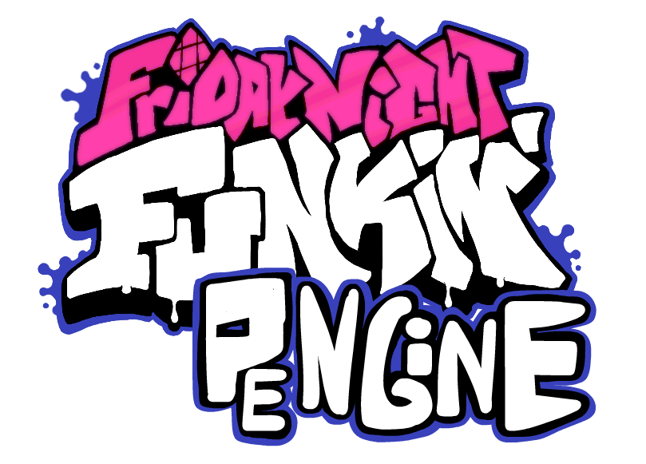

# Friday Night Funkin': PEngine
<p align="center">
  
</p>

Engine made mainly to improve vanilla client and make modding easier and MUCH faster. <br>
To start Modding check out [The Wiki!](https://github.com/Paidyy/Funkin-PEngine/wiki)
## Setting Shit up
1. Install [Haxe](https://haxe.org/download/) and [HaxeFlixel](https://haxeflixel.com/documentation/install-haxeflixel/) or if you already have installed update Haxe and HaxeFlixel to latest version so it doesn't throw exceptions when compiling
2. Run [InstallLibraries.bat](https://raw.githack.com/Paidyy/Funkin-PEngine/main/art/installLibraries.bat) or install these libraries using Command Line:
``` bat
haxelib install flixel-addons
haxelib install flixel-ui
haxelib install hscript
haxelib git discord_rpc https://github.com/Aidan63/linc_discord-rpc
haxelib install openfl-webm
haxelib git yaml https://github.com/Paidyy/haxe-yaml.git
haxelib install linc_luajit
haxelib install udprotean
haxelib git linc_clipboard https://github.com/josuigoa/linc_clipboard.git
haxelib install markdown
```
3. And to compile just type ```lime test windows -debug``` or ```lime test windows``` in current folder command line

Also the source code for update unzipper is [here](https://github.com/Paidyy/Funkin-PEngine-Unzipper) <br>
*Message to motherfuckers from gamaverse: this engine supports html5 partially, have fun on trying to ~~port~~ steal someone's mod to your garbage site <3*
## Nice Stuff / Features
* LAN Multiplayer
* Action Notes
* Custom Skins (no need to change character in chart editor!)
* Make mods without touching code
* 5K to 9K Mania Support
* Modcharts
* Configs are in YAML instead of JSON so it is easier to read them
* Dialogue Cutscenes
* [Lua Support](https://github.com/Paidyy/Funkin-PEngine/wiki/Lua-Documentation)
* Version Updater
* Custom Keybinds
* Some fixes / improvements to Vanilla
## NFAQ (not frequently asked questions)
### Why should i use this over other engines?
1. The character / stage configs are stored in yaml instead of json so they are more readable
2. It's easier to add more songs to the game just copy folders from songs/ and data/ into mods/songs and you just have imported a mod from another engine without editing any files
3. LAN MULTIPLAYERRRRRRRRRRR
4. Crash Handler
5. Easy to add skins without changing the character in chart editor
6. You can change the dimness and blur of game background
7. Not another psych fork
8. You can copy and paste shit to text boxes instead of typing them manually
9. Songs are stored only in songs/ instead of songs/ and data/
10. There's, stage editor so you don't need to touch the source code or lua
11. 4K to 9K mania support
12. In-Game Version Updater, also you can skip updates unlike psych
13. In-Song Options
### Game crashess!!!111
Get the exception and report it on https://github.com/Paidyy/Funkin-PEngine/issues
### Input doesnt remove hitted note
In Chart Editor press Remove Cloned Notes button in Song section or try re-adding the note
If these methods doesn't work then report them on https://github.com/Paidyy/Funkin-PEngine/issues
## Credits
### PEngine
- [Paidyy](https://paidyy.newgrounds.com/) - PEngine Programmer
### Special Thanks
- [PolybiusProxy](https://github.com/brightfyregit/Friday-Night-Funkin-Mp4-Video-Support) - Video Loader for Flixel
- [gedehari and Shadow Mario](https://github.com/ShadowMario/FNF-PsychEngine/blob/f4cf818dac20859fd0223206609ba91b6818831f/source/editors/ChartingState.hx#L2022) - Waveform for Flixel
### Friday Night Funkin'
- [ninjamuffin99](https://twitter.com/ninja_muffin99) - Programmer
- [PhantomArcade3K](https://twitter.com/phantomarcade3k) and [Evilsk8r](https://twitter.com/evilsk8r) - Artists
- [Kawaisprite](https://twitter.com/kawaisprite) - Musician
